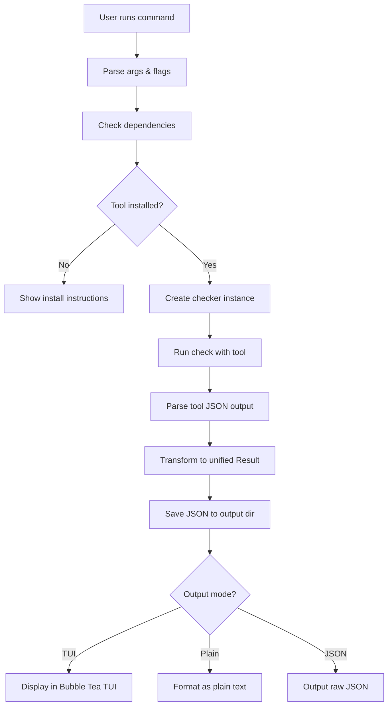

# Marvin CLI

A documentation quality assurance CLI tool with an interactive TUI, built with Go.

## Tech Stack

- Written in Golang using [Cobra](https://github.com/spf13/cobra), [Bubble Tea](https://github.com/charmbracelet/bubbletea) and [lipgloss](https://github.com/charmbracelet/lipgloss)
- [GoReleaser](https://github.com/goreleaser/goreleaser) for publishing
- Uses [golangci-lint](https://github.com/golangci/golangci-lint) for linting (must pass)

## Architecture Overview

### Core Design Principles

1. **TUI as Pure Viewer**: The TUI displays results but doesn't perform checks
2. **Data Models for Frontend**: Design with Next.js dashboard integration in mind
3. **Extensible Command Structure**: Unified pattern for adding new QA checks
4. **JSON Output**: All check results must be placed in a dedicated directory
5. **Dependency Detection**: CLI must verify that external tools (vale, markdownlint) are installed via brew or npm before running checks
6. **One Command Per File**: Each new command requires a new file under `cmd/`

### Directory Structure

```
cli/
├── cmd/                    # Command implementations (one file per command)
│   ├── root.go            # Root command and global flags
│   ├── help.go            # Help command
│   ├── vale.go            # Vale check command
│   └── markdownlint.go    # Future: markdownlint command
├── internal/
│   ├── app/               # Application-specific code
│   │   ├── checker/       # Check execution logic
│   │   │   ├── checker.go        # Base checker interface
│   │   │   ├── vale.go           # Vale checker implementation
│   │   │   └── markdownlint.go   # Future: markdownlint implementation
│   │   ├── dependency/    # Dependency detection
│   │   │   ├── detector.go       # Dependency detector interface
│   │   │   ├── brew.go           # Homebrew detection
│   │   │   └── npm.go            # npm/package.json detection
│   │   ├── output/        # Output handling
│   │   │   ├── writer.go         # JSON output writer
│   │   │   └── formatter.go      # Plain text formatter
│   │   └── tui/           # TUI components
│   │       ├── viewer.go         # Main TUI viewer
│   │       ├── models.go         # Bubble Tea models
│   │       └── styles.go         # lipgloss styles
│   └── pkg/               # Shared internal libraries
│       ├── config/        # Configuration management
│       │   └── config.go
│       └── models/        # Shared data models
│           ├── result.go         # Check result models
│           └── metadata.go       # Metadata models
├── test/                  # External test apps and test data
│   └── fixtures/          # Test fixtures
└── tools/                 # Supporting tools
```

## Command Structure

### Root Command

```bash
marvin [command] [flags]
```

**Global Flags:**

- `--output-dir` - Output directory for JSON results (default: `.marvin/results/`)
- `--no-tui` - Disable TUI, output plain text to stdout
- `--json` - Output raw JSON to stdout (implies `--no-tui`)
- `--verbose` - Enable verbose logging
- `--config` - Path to config file (default: `.marvin.yaml`)

### Help Command

**File:** [`cmd/help.go`](cmd/help.go)

```bash
marvin help [command]
```

Displays help information for Marvin or a specific command.

**Implementation:**

- Leverages Cobra's built-in help system
- Custom formatting using lipgloss for better readability
- Shows examples for each command
- Lists available commands with descriptions

### Vale Command

**File:** [`cmd/vale.go`](cmd/vale.go)

```bash
marvin vale [path] [flags]
```

Runs Vale prose linting on documentation files.

**Arguments:**

- `path` - Path to scan (optional, default: `docs/`)

**Flags:**

- `--config` - Vale config file path (default: auto-detect `.vale.ini`)
- `--min-alert-level` - Minimum alert level (suggestion, warning, error)
- `--output-dir` - Override global output directory
- `--no-tui` - Disable TUI viewer
- `--json` - Output raw JSON

**Behavior:**

1. Check if Vale is installed (via brew or npm)
2. If not found, display installation instructions and exit
3. Run Vale with `--output=JSON` flag
4. Save JSON results to `.marvin/results/vale-{timestamp}.json`
5. Parse JSON results into internal data model
6. Display results via TUI (default) or plain text (if `--no-tui`)

**Example:**

```bash
# Scan default docs/ directory with TUI
marvin vale

# Scan specific directory
marvin vale ./content

# Output JSON only
marvin vale --json

# Disable TUI, show plain text
marvin vale --no-tui
```

## Unified Command Pattern

All QA check commands (vale, markdownlint, etc.) follow this pattern:

### 1. Command File Structure

Each command file in [`cmd/`](cmd/) follows this template:

```go
package cmd

import (
    "github.com/spf13/cobra"
    "marvin/internal/app/checker"
    "marvin/internal/app/dependency"
    "marvin/internal/app/output"
    "marvin/internal/app/tui"
)

var valeCmd = &cobra.Command{
    Use:   "vale [path]",
    Short: "Run Vale prose linting",
    Long:  `Detailed description...`,
    Args:  cobra.MaximumNArgs(1),
    RunE:  runVale,
}

func init() {
    rootCmd.AddCommand(valeCmd)
    
    // Command-specific flags
    valeCmd.Flags().String("config", "", "Vale config file path")
    valeCmd.Flags().String("min-alert-level", "suggestion", "Minimum alert level")
}

func runVale(cmd *cobra.Command, args []string) error {
    // 1. Parse arguments and flags
    // 2. Check dependencies
    // 3. Run checker
    // 4. Save results
    // 5. Display output
}
```

### 2. Checker Interface

All checkers implement this interface in [`internal/app/checker/checker.go`](internal/app/checker/checker.go):

```go
type Checker interface {
    // Name returns the checker name
    Name() string
    
    // Check runs the check and returns results
    Check(ctx context.Context, opts CheckOptions) (*Result, error)
    
    // Validate validates the checker configuration
    Validate() error
}

type CheckOptions struct {
    Path          string
    ConfigFile    string
    OutputFormat  string
    ExtraArgs     []string
}

type Result struct {
    Checker   string                 `json:"checker"`
    Timestamp time.Time              `json:"timestamp"`
    Path      string                 `json:"path"`
    Summary   Summary                `json:"summary"`
    Issues    []Issue                `json:"issues"`
    Metadata  map[string]interface{} `json:"metadata"`
}

type Summary struct {
    TotalFiles    int `json:"total_files"`
    FilesWithIssues int `json:"files_with_issues"`
    TotalIssues   int `json:"total_issues"`
    ErrorCount    int `json:"error_count"`
    WarningCount  int `json:"warning_count"`
    InfoCount     int `json:"info_count"`
}

type Issue struct {
    File     string `json:"file"`
    Line     int    `json:"line"`
    Column   int    `json:"column"`
    Severity string `json:"severity"`
    Message  string `json:"message"`
    Rule     string `json:"rule"`
    Context  string `json:"context,omitempty"`
}
```

### 3. Dependency Detection

The dependency detector in [`internal/app/dependency/detector.go`](internal/app/dependency/detector.go):

```go
type Detector interface {
    // IsInstalled checks if a tool is installed
    IsInstalled(tool string) (bool, string, error)
    
    // GetInstallInstructions returns installation instructions
    GetInstallInstructions(tool string) string
}

type MultiDetector struct {
    detectors []Detector
}

// Check order: brew -> npm -> system PATH
func (d *MultiDetector) IsInstalled(tool string) (bool, string, error) {
    // 1. Check Homebrew: brew list <tool>
    // 2. Check npm: look for node_modules/.bin/<tool> or global npm
    // 3. Check system PATH: which <tool>
    // Return first match with installation method
}
```

**Detection Logic:**

1. **Homebrew Detection** ([`internal/app/dependency/brew.go`](internal/app/dependency/brew.go)):
   - Run `brew list <tool>` to check if installed
   - Return path from `brew --prefix <tool>`

2. **npm Detection** ([`internal/app/dependency/npm.go`](internal/app/dependency/npm.go)):
   - Check `node_modules/.bin/<tool>` in current directory
   - Check `package.json` for tool in dependencies/devDependencies
   - Check global npm: `npm list -g <tool>`

3. **System PATH Detection**:
   - Use `exec.LookPath(tool)` to find in system PATH

**Error Handling:**
- If tool not found, display friendly error with installation instructions
- Show detected package managers (brew, npm) and suggest installation method
- Provide links to official documentation

### 4. Output Management

The output writer in [`internal/app/output/writer.go`](internal/app/output/writer.go):

```go
type Writer interface {
    // Write saves results to the output directory
    Write(result *checker.Result) (string, error)
    
    // GetOutputPath returns the full output path
    GetOutputPath(checkerName string) string
}

type JSONWriter struct {
    outputDir string
}

// Filename format: {checker}-{timestamp}.json
// Example: vale-20260102-130000.json
func (w *JSONWriter) Write(result *checker.Result) (string, error) {
    // 1. Ensure output directory exists
    // 2. Generate filename with timestamp
    // 3. Marshal result to JSON with indentation
    // 4. Write to file
    // 5. Return full path
}
```

### 5. TUI Display

The TUI viewer in [`internal/app/tui/viewer.go`](internal/app/tui/viewer.go):

```go
type Model struct {
    result   *checker.Result
    viewport viewport.Model
    ready    bool
}

// Display results in an interactive TUI
func ShowResults(result *checker.Result) error {
    // 1. Create Bubble Tea model
    // 2. Format results with lipgloss
    // 3. Enable scrolling for long output
    // 4. Add keyboard shortcuts (q to quit, arrows to scroll)
    // 5. Show summary at top, issues below
}
```

**TUI Layout:**
```
┌─────────────────────────────────────────────────────────────┐
│ Marvin - Vale Results                                       │
├─────────────────────────────────────────────────────────────┤
│ Summary:                                                    │
│   Files Scanned: 42                                         │
│   Files with Issues: 8                                      │
│   Total Issues: 23 (5 errors, 12 warnings, 6 suggestions)  │
│                                                             │
│ Issues:                                                     │
│ ┌───────────────────────────────────────────────────────┐  │
│ │ docs/getting-started.md:12:5                          │  │
│ │ [error] Vale.Spelling                                 │  │
│ │ Did you really mean 'installtion'?                    │  │
│ │                                                        │  │
│ │ docs/api-reference.md:45:10                           │  │
│ │ [warning] Vale.Terms                                  │  │
│ │ Use 'API' instead of 'api'                            │  │
│ └───────────────────────────────────────────────────────┘  │
│                                                             │
│ Press q to quit, ↑/↓ to scroll                             │
└─────────────────────────────────────────────────────────────┘
```

## Configuration

### Config File Format

**File:** `.marvin.yaml` (project root)

```yaml
# Default output directory
output_dir: .marvin/results/

# Default scan paths for each checker
defaults:
  vale:
    path: docs/
    config: .vale.ini
    min_alert_level: suggestion
  
  markdownlint:
    path: docs/
    config: .markdownlint.yaml

# TUI settings
tui:
  enabled: true
  theme: default

# Dependency detection
dependencies:
  check_brew: true
  check_npm: true
  check_system: true
```

## Adding New Commands

To add a new QA check command (e.g., `markdownlint`):

### Step 1: Create Command File

Create [`cmd/markdownlint.go`](cmd/markdownlint.go):

```go
package cmd

import (
    "github.com/spf13/cobra"
    "marvin/internal/app/checker"
    // ... other imports
)

var markdownlintCmd = &cobra.Command{
    Use:   "markdownlint [path]",
    Short: "Run markdownlint on Markdown files",
    Long:  `Runs markdownlint to check Markdown files for style issues.`,
    Args:  cobra.MaximumNArgs(1),
    RunE:  runMarkdownlint,
}

func init() {
    rootCmd.AddCommand(markdownlintCmd)
    
    // Add command-specific flags
    markdownlintCmd.Flags().String("config", "", "markdownlint config file")
}

func runMarkdownlint(cmd *cobra.Command, args []string) error {
    // Follow the unified pattern (see below)
}
```

### Step 2: Implement Checker

Create [`internal/app/checker/markdownlint.go`](internal/app/checker/markdownlint.go):

```go
package checker

import (
    "context"
    "encoding/json"
    "os/exec"
)

type MarkdownlintChecker struct {
    configFile string
}

func NewMarkdownlintChecker(configFile string) *MarkdownlintChecker {
    return &MarkdownlintChecker{
        configFile: configFile,
    }
}

func (c *MarkdownlintChecker) Name() string {
    return "markdownlint"
}

func (c *MarkdownlintChecker) Check(ctx context.Context, opts CheckOptions) (*Result, error) {
    // 1. Build command: markdownlint --json <path>
    // 2. Execute command
    // 3. Parse JSON output
    // 4. Transform to unified Result format
    // 5. Return result
}

func (c *MarkdownlintChecker) Validate() error {
    // Validate configuration
}
```

### Step 3: Follow Unified Execution Pattern

In the `runMarkdownlint` function:

```go
func runMarkdownlint(cmd *cobra.Command, args []string) error {
    // 1. Parse arguments and flags
    path := "docs/" // default
    if len(args) > 0 {
        path = args[0]
    }
    
    configFile, _ := cmd.Flags().GetString("config")
    outputDir, _ := cmd.Flags().GetString("output-dir")
    noTUI, _ := cmd.Flags().GetBool("no-tui")
    jsonOutput, _ := cmd.Flags().GetBool("json")
    
    // 2. Check dependencies
    detector := dependency.NewMultiDetector()
    installed, method, err := detector.IsInstalled("markdownlint")
    if !installed {
        fmt.Println(detector.GetInstallInstructions("markdownlint"))
        return fmt.Errorf("markdownlint not found")
    }
    
    // 3. Create and run checker
    checker := checker.NewMarkdownlintChecker(configFile)
    result, err := checker.Check(cmd.Context(), checker.CheckOptions{
        Path:       path,
        ConfigFile: configFile,
    })
    if err != nil {
        return err
    }
    
    // 4. Save results
    writer := output.NewJSONWriter(outputDir)
    outputPath, err := writer.Write(result)
    if err != nil {
        return err
    }
    
    // 5. Display output
    if jsonOutput {
        // Output raw JSON to stdout
        json.NewEncoder(os.Stdout).Encode(result)
    } else if noTUI {
        // Output plain text
        formatter := output.NewPlainTextFormatter()
        formatter.Format(result, os.Stdout)
    } else {
        // Show TUI
        tui.ShowResults(result)
    }
    
    fmt.Printf("\nResults saved to: %s\n", outputPath)
    return nil
}
```

### Step 4: Update Documentation

1. Add command to [`docs/reference/cli.md`](../docs/reference/cli.md)
2. Add examples to help text
3. Update this README with command details

## Data Flow



## Testing Strategy

### Unit Tests

Each package should have comprehensive unit tests:

- [`internal/app/checker/vale_test.go`](internal/app/checker/vale_test.go) - Test Vale checker
- [`internal/app/dependency/detector_test.go`](internal/app/dependency/detector_test.go) - Test dependency detection
- [`internal/app/output/writer_test.go`](internal/app/output/writer_test.go) - Test output writing

### Integration Tests

Test complete command execution:

```go
func TestValeCommand(t *testing.T) {
    // 1. Create test fixtures in test/fixtures/
    // 2. Run command with test data
    // 3. Verify JSON output
    // 4. Verify exit codes
}
```

### Test Fixtures

Store test data in [`test/fixtures/`](test/fixtures/):

```
test/fixtures/
├── vale/
│   ├── .vale.ini
│   ├── valid.md
│   └── invalid.md
└── markdownlint/
    ├── .markdownlint.yaml
    ├── valid.md
    └── invalid.md
```

## Error Handling

### Dependency Not Found

```
Error: Vale is not installed

Marvin requires Vale to run prose linting checks.

Installation options:

  Homebrew (recommended):
    brew install vale

  npm:
    npm install -g vale

  Manual:
    https://vale.sh/docs/vale-cli/installation/

After installation, run this command again.
```

### Check Execution Failed

```
Error: Vale check failed

Command: vale --output=JSON docs/
Exit code: 1

Output:
  [error message from vale]

Troubleshooting:
  - Check that your .vale.ini configuration is valid
  - Ensure the path exists: docs/
  - Run vale directly to see detailed errors: vale docs/
```

## Future Enhancements

### Planned Commands

1. **markdownlint** - Markdown linting
2. **linkcheck** - Broken link detection
3. **spellcheck** - Spell checking (using aspell/hunspell)
4. **all** - Run all checks sequentially

### Planned Features

1. **Watch Mode** - Continuously monitor files for changes
2. **CI Mode** - Exit with non-zero code on errors
3. **Report Generation** - HTML/PDF reports
4. **Baseline Support** - Ignore existing issues, only show new ones
5. **Parallel Execution** - Run multiple checks concurrently
6. **Custom Plugins** - Allow users to add custom checkers

## Development Workflow

### Setup

```bash
# Enter devbox shell
devbox shell

# Install Go dependencies
go mod download

# Run linter
golangci-lint run

# Run tests
go test ./...
```

### Building

```bash
# Build for current platform
go build -o marvin ./cmd

# Build for all platforms (using GoReleaser)
goreleaser build --snapshot --clean
```

### Running Locally

```bash
# Run without building
go run . vale docs/

# Run with flags
go run . vale --no-tui docs/

# Run help
go run . help vale
```

## Code Style Guidelines

1. **Follow Go conventions** - Use `gofmt`, `goimports`
2. **Pass golangci-lint** - All code must pass linting
3. **Write tests** - Aim for >80% coverage
4. **Document exports** - All exported functions/types need godoc comments
5. **Use interfaces** - Design for testability and extensibility
6. **Handle errors** - Never ignore errors, wrap with context
7. **Keep it simple** - Prefer clarity over cleverness

## Resources

- [Cobra Documentation](https://cobra.dev/)
- [Bubble Tea Tutorial](https://github.com/charmbracelet/bubbletea/tree/master/tutorials)
- [lipgloss Examples](https://github.com/charmbracelet/lipgloss/tree/master/examples)
- [Vale Documentation](https://vale.sh/docs/)
- [markdownlint Rules](https://github.com/DavidAnson/markdownlint/blob/main/doc/Rules.md)
