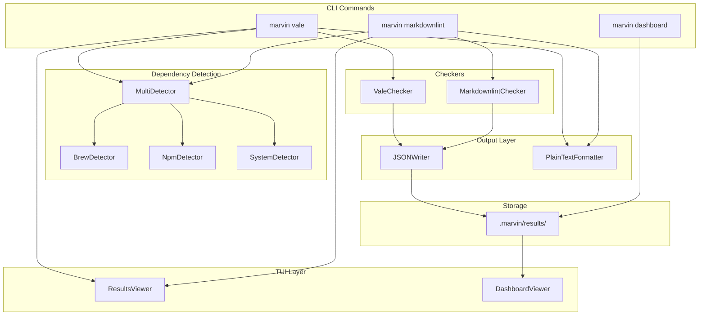
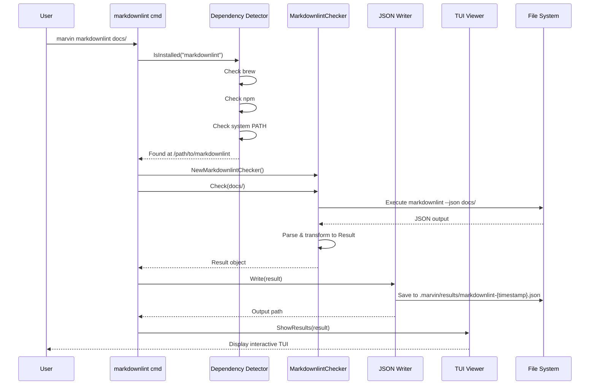
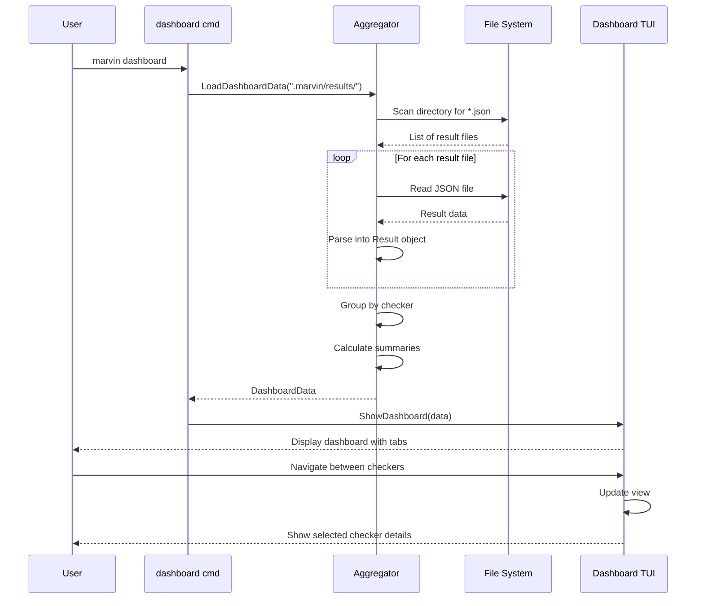
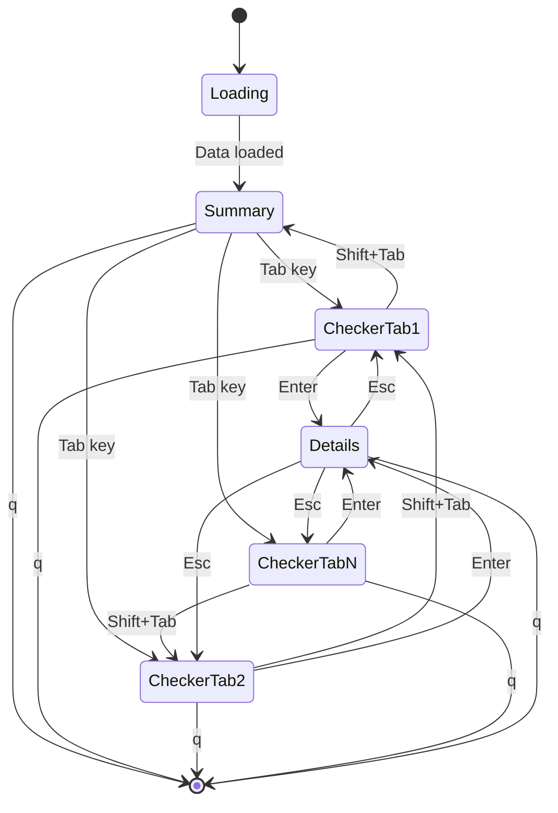
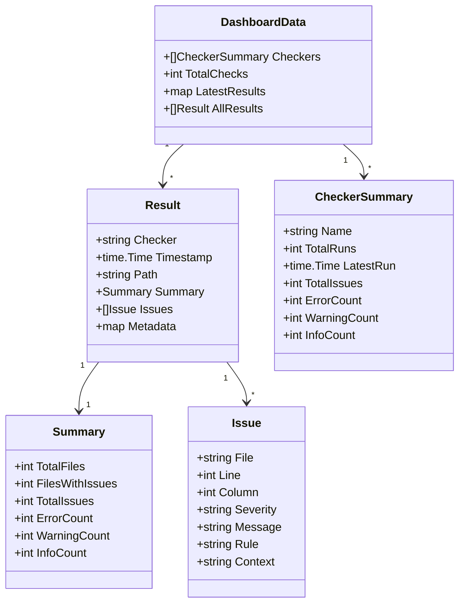
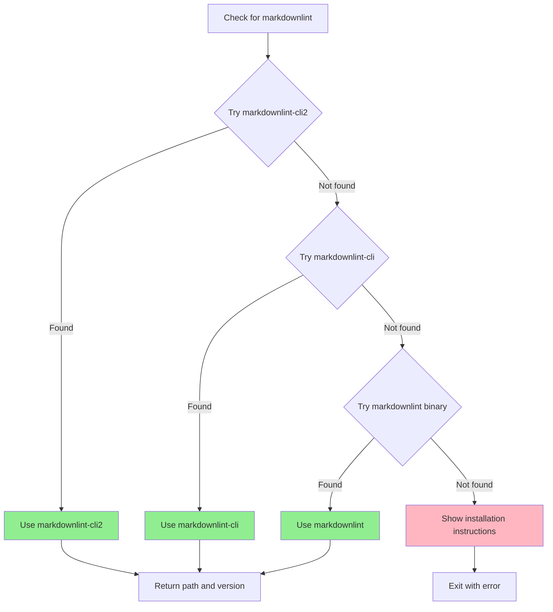
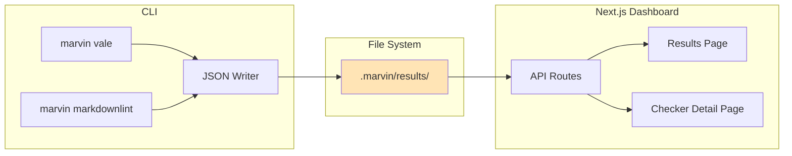
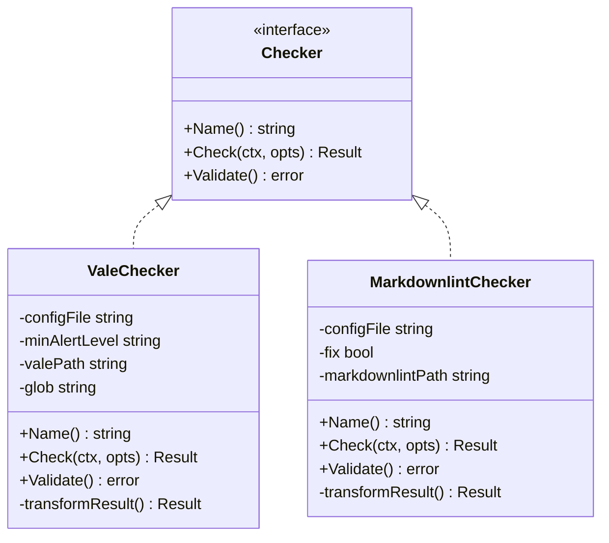

# Marvin CLI Architecture - Markdownlint & Dashboard

## System Architecture Overview



## Command Flow - Markdownlint



## Dashboard Data Flow



## File Structure After Implementation

```
cli/
├── cmd/
│   ├── root.go              # Root command (existing)
│   ├── help.go              # Help command (update)
│   ├── vale.go              # Vale command (existing)
│   ├── markdownlint.go      # NEW: Markdownlint command
│   └── dashboard.go         # NEW: Dashboard command
│
├── internal/
│   ├── app/
│   │   ├── checker/
│   │   │   ├── checker.go           # Interface (existing)
│   │   │   ├── vale.go              # Vale implementation (existing)
│   │   │   ├── vale_test.go         # Vale tests (existing)
│   │   │   ├── markdownlint.go      # NEW: Markdownlint implementation
│   │   │   └── markdownlint_test.go # NEW: Markdownlint tests
│   │   │
│   │   ├── dependency/
│   │   │   ├── detector.go          # Multi-detector (update)
│   │   │   ├── brew.go              # Brew detection (existing)
│   │   │   ├── npm.go               # npm detection (existing)
│   │   │   └── system.go            # System PATH (existing)
│   │   │
│   │   ├── dashboard/               # NEW: Dashboard package
│   │   │   ├── aggregator.go        # Result aggregation
│   │   │   └── aggregator_test.go   # Aggregator tests
│   │   │
│   │   ├── output/
│   │   │   ├── writer.go            # JSON writer (existing)
│   │   │   └── formatter.go         # Plain text (existing)
│   │   │
│   │   └── tui/
│   │       ├── viewer.go            # Single result viewer (existing)
│   │       ├── dashboard.go         # NEW: Dashboard viewer
│   │       └── styles.go            # Shared styles (existing)
│   │
│   └── pkg/
│       └── models/
│           ├── result.go            # Result models (existing)
│           └── dashboard.go         # NEW: Dashboard models
│
└── test/
    └── fixtures/
        ├── vale/                    # Vale test data (existing)
        └── markdownlint/            # NEW: Markdownlint test data
            ├── .markdownlint.yaml
            ├── valid.md
            └── invalid.md
```

## TUI State Machine - Dashboard



## Data Model Relationships



## Dependency Detection Flow



## Integration with Next.js Dashboard



## Checker Interface Implementation



## Output Directory Structure

```
.marvin/
└── results/
    ├── vale-20260104-090000.json
    ├── vale-20260104-100000.json
    ├── vale-20260104-110000.json
    ├── markdownlint-20260104-090500.json
    ├── markdownlint-20260104-100500.json
    └── markdownlint-20260104-110500.json
```

Each JSON file contains a complete `Result` object:
```json
{
  "checker": "markdownlint",
  "timestamp": "2026-01-04T09:05:00Z",
  "path": "docs/",
  "summary": {
    "total_files": 38,
    "files_with_issues": 12,
    "total_issues": 24,
    "error_count": 5,
    "warning_count": 11,
    "info_count": 8
  },
  "issues": [...],
  "metadata": {
    "config_file": ".markdownlint.yaml",
    "version": "0.32.0"
  }
}
```
