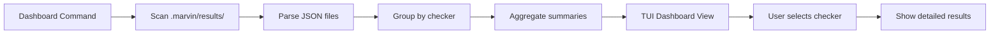

# Plan: Add Markdownlint Command and Dashboard to Marvin CLI

## Overview

This plan outlines the implementation of:
1. A new `markdownlint` command following the same pattern as the existing `vale` command
2. A `dashboard` command to view aggregated results from all checks in the TUI
3. Enhanced TUI components to support multi-checker views

## Context

- **Current State**: CLI has a working `vale` command with dependency detection, JSON output, and TUI display
- **Goal**: Add `markdownlint` command and create a unified dashboard view for all check results
- **Alignment**: Follows existing patterns in [`cli/README.md`](../cli/README.md) and [`AGENTS.md`](../AGENTS.md)

## Architecture Decisions

### 1. Markdownlint Tool Detection

The CLI must detect markdownlint installed via:
- **Homebrew**: `brew list markdownlint-cli` or `brew list markdownlint-cli2`
- **npm (local)**: Check `node_modules/.bin/markdownlint` or `node_modules/.bin/markdownlint-cli2`
- **npm (global)**: `npm list -g markdownlint-cli` or `npm list -g markdownlint-cli2`
- **System PATH**: `which markdownlint` or `which markdownlint-cli2`

**Note**: There are two versions of markdownlint CLI:
- `markdownlint-cli` (original, Node.js-based)
- `markdownlint-cli2` (newer, faster version)

We should support both, preferring `markdownlint-cli2` if available.

### 2. Markdownlint JSON Output Format

Markdownlint outputs JSON in this format:

```json
{
  "file1.md": [
    {
      "lineNumber": 1,
      "ruleNames": ["MD041", "first-line-heading"],
      "ruleDescription": "First line in a file should be a top-level heading",
      "ruleInformation": "https://github.com/DavidAnson/markdownlint/blob/main/doc/md041.md",
      "errorDetail": null,
      "errorContext": null,
      "errorRange": null
    }
  ]
}
```

This needs to be transformed to our unified [`Result`](../cli/internal/pkg/models/result.go) format.

### 3. Dashboard Architecture

The dashboard will:
- Read all JSON files from `.marvin/results/` directory
- Parse and aggregate results from different checkers
- Display a summary view with tabs/sections for each checker
- Allow navigation between different check results

**Dashboard Data Flow**:



### 4. TUI Enhancement Strategy

Current TUI shows single check results. We need to enhance it to support:

**Option A: Tabbed Interface** (Recommended)
- Top-level tabs for each checker type
- Summary cards showing latest results
- Drill-down to detailed issue view

**Option B: Separate Dashboard Model**
- New `DashboardModel` in addition to existing `Model`
- Switch between dashboard and detail views
- More complex but cleaner separation

**Decision**: Use Option A with enhanced `Model` that supports both single-result and multi-result modes.

## Implementation Plan

### Phase 1: Markdownlint Command

#### 1.1 Create Command File

**File**: [`cli/cmd/markdownlint.go`](../cli/cmd/markdownlint.go)

**Structure**:
```go
package cmd

import (
    "encoding/json"
    "fmt"
    "os"
    
    "github.com/spf13/cobra"
    "github.com/svx/marvin/cli/internal/app/checker"
    "github.com/svx/marvin/cli/internal/app/dependency"
    "github.com/svx/marvin/cli/internal/app/output"
    "github.com/svx/marvin/cli/internal/app/tui"
)

var (
    markdownlintConfig string
    markdownlintFix    bool
)

var markdownlintCmd = &cobra.Command{
    Use:   "markdownlint [path]",
    Short: "Run markdownlint on Markdown files",
    Long:  `Run markdownlint to check Markdown files for style and syntax issues...`,
    Args:  cobra.MaximumNArgs(1),
    RunE:  runMarkdownlint,
    Example: `  # Scan default docs/ directory
  marvin markdownlint
  
  # Scan specific directory
  marvin markdownlint ./content
  
  # Use custom config
  marvin markdownlint --config .markdownlint.yaml`,
}

func init() {
    rootCmd.AddCommand(markdownlintCmd)
    
    markdownlintCmd.Flags().StringVar(&markdownlintConfig, "config", "", 
        "markdownlint config file (default: auto-detect .markdownlint.yaml)")
    markdownlintCmd.Flags().BoolVar(&markdownlintFix, "fix", false, 
        "Automatically fix issues where possible")
}

func runMarkdownlint(cmd *cobra.Command, args []string) error {
    // Follow same pattern as vale.go
    // 1. Parse arguments
    // 2. Check dependencies
    // 3. Create and run checker
    // 4. Save results
    // 5. Display output
}
```

**Key Features**:
- Default path: `docs/`
- Auto-detect config file: `.markdownlint.yaml`, `.markdownlint.json`, `.markdownlintrc`
- Support `--fix` flag for auto-fixing issues
- Same output modes as vale: TUI (default), `--no-tui`, `--json`

#### 1.2 Implement Checker

**File**: [`cli/internal/app/checker/markdownlint.go`](../cli/internal/app/checker/markdownlint.go)

**Structure**:
```go
package checker

import (
    "context"
    "encoding/json"
    "fmt"
    "os/exec"
    "time"
    
    "github.com/svx/marvin/cli/internal/pkg/models"
)

type MarkdownlintChecker struct {
    configFile        string
    fix               bool
    markdownlintPath  string
}

// MarkdownlintOutput represents the JSON output format
type MarkdownlintOutput map[string][]MarkdownlintIssue

type MarkdownlintIssue struct {
    LineNumber       int      `json:"lineNumber"`
    RuleNames        []string `json:"ruleNames"`
    RuleDescription  string   `json:"ruleDescription"`
    RuleInformation  string   `json:"ruleInformation"`
    ErrorDetail      *string  `json:"errorDetail"`
    ErrorContext     *string  `json:"errorContext"`
    ErrorRange       []int    `json:"errorRange"`
}

func NewMarkdownlintChecker(configFile string, fix bool, path string) *MarkdownlintChecker {
    // Implementation
}

func (c *MarkdownlintChecker) Name() string {
    return "markdownlint"
}

func (c *MarkdownlintChecker) Validate() error {
    // Check if markdownlint is available
}

func (c *MarkdownlintChecker) Check(ctx context.Context, opts CheckOptions) (*models.Result, error) {
    // Build command: markdownlint --json <path>
    // Execute and parse output
    // Transform to unified Result format
}

func (c *MarkdownlintChecker) transformResult(output MarkdownlintOutput, path string) *models.Result {
    // Convert markdownlint format to models.Result
}
```

**Command Construction**:
```bash
# Basic command
markdownlint --json docs/

# With config
markdownlint --json --config .markdownlint.yaml docs/

# With fix
markdownlint --json --fix docs/
```

**Severity Mapping**:
- All markdownlint issues are "error" by default
- Map to our severity levels based on rule configuration if available
- Default: treat as "warning" for consistency

#### 1.3 Update Dependency Detection

**Enhancement to**: [`cli/internal/app/dependency/detector.go`](../cli/internal/app/dependency/detector.go)

Add support for detecting both `markdownlint-cli` and `markdownlint-cli2`:

```go
func (d *MultiDetector) IsInstalled(tool string) (bool, string, error) {
    // Special handling for markdownlint
    if tool == "markdownlint" {
        // Try markdownlint-cli2 first (preferred)
        if installed, path, err := d.checkTool("markdownlint-cli2"); installed {
            return true, path, nil
        }
        // Fall back to markdownlint-cli
        if installed, path, err := d.checkTool("markdownlint-cli"); installed {
            return true, path, nil
        }
        // Try just "markdownlint" binary
        return d.checkTool("markdownlint")
    }
    
    return d.checkTool(tool)
}
```

**Installation Instructions**:
```
Error: markdownlint is not installed

Marvin requires markdownlint to check Markdown files for style issues.

Installation options:

  Homebrew (recommended):
    brew install markdownlint-cli2

  npm (global):
    npm install -g markdownlint-cli2

  npm (project):
    npm install --save-dev markdownlint-cli2

  Manual:
    https://github.com/DavidAnson/markdownlint

After installation, run this command again.
```

#### 1.4 Update Help Command

**File**: [`cli/cmd/help.go`](../cli/cmd/help.go)

Add markdownlint to the commands list:

```go
commands := []struct {
    name string
    desc string
}{
    {"vale", "Run Vale prose linting on documentation"},
    {"markdownlint", "Run markdownlint on Markdown files"},
    {"dashboard", "View aggregated results from all checks"},
    {"help", "Help about any command"},
}
```

Add example:
```go
fmt.Println("  # Run markdownlint on default docs/ directory")
fmt.Println("  marvin markdownlint")
fmt.Println()
```

### Phase 2: Dashboard Command

#### 2.1 Create Dashboard Command

**File**: [`cli/cmd/dashboard.go`](../cli/cmd/dashboard.go)

**Structure**:
```go
package cmd

import (
    "github.com/spf13/cobra"
    "github.com/svx/marvin/cli/internal/app/dashboard"
    "github.com/svx/marvin/cli/internal/app/tui"
)

var dashboardCmd = &cobra.Command{
    Use:   "dashboard",
    Short: "View aggregated results from all checks",
    Long: `Display a dashboard showing results from all documentation QA checks.
    
The dashboard reads all check results from the output directory and displays
them in an interactive TUI with summary statistics and drill-down capabilities.`,
    RunE: runDashboard,
    Example: `  # Show dashboard with all results
  marvin dashboard
  
  # Show dashboard with custom output directory
  marvin dashboard --output-dir ./custom-results`,
}

func init() {
    rootCmd.AddCommand(dashboardCmd)
}

func runDashboard(cmd *cobra.Command, args []string) error {
    // 1. Scan output directory for JSON files
    // 2. Parse and aggregate results
    // 3. Display in TUI dashboard
}
```

#### 2.2 Create Dashboard Package

**File**: [`cli/internal/app/dashboard/aggregator.go`](../cli/internal/app/dashboard/aggregator.go)

**Purpose**: Scan results directory and aggregate data

```go
package dashboard

import (
    "encoding/json"
    "os"
    "path/filepath"
    "sort"
    "time"
    
    "github.com/svx/marvin/cli/internal/pkg/models"
)

type DashboardData struct {
    Checkers       []CheckerSummary
    TotalChecks    int
    LatestResults  map[string]*models.Result
    AllResults     []*models.Result
}

type CheckerSummary struct {
    Name           string
    TotalRuns      int
    LatestRun      time.Time
    TotalIssues    int
    ErrorCount     int
    WarningCount   int
    InfoCount      int
}

func LoadDashboardData(outputDir string) (*DashboardData, error) {
    // 1. Scan directory for *.json files
    // 2. Parse each file into models.Result
    // 3. Group by checker
    // 4. Calculate summaries
    // 5. Return aggregated data
}

func scanResultsDirectory(dir string) ([]string, error) {
    // Find all JSON files matching pattern: {checker}-{timestamp}.json
}

func parseResultFile(path string) (*models.Result, error) {
    // Read and unmarshal JSON file
}

func aggregateResults(results []*models.Result) *DashboardData {
    // Group by checker and calculate summaries
}
```

#### 2.3 Enhance TUI for Dashboard

**File**: [`cli/internal/app/tui/dashboard.go`](../cli/internal/app/tui/dashboard.go)

**New dashboard-specific TUI model**:

```go
package tui

import (
    tea "github.com/charmbracelet/bubbletea"
    "github.com/svx/marvin/cli/internal/app/dashboard"
)

type DashboardModel struct {
    data         *dashboard.DashboardData
    selectedTab  int
    viewMode     string // "summary" or "details"
    ready        bool
    quitting     bool
}

func ShowDashboard(data *dashboard.DashboardData) error {
    p := tea.NewProgram(initialDashboardModel(data))
    if _, err := p.Run(); err != nil {
        return err
    }
    return nil
}

func initialDashboardModel(data *dashboard.DashboardData) DashboardModel {
    return DashboardModel{
        data:        data,
        selectedTab: 0,
        viewMode:    "summary",
        ready:       true,
    }
}

func (m DashboardModel) Update(msg tea.Msg) (tea.Model, tea.Cmd) {
    switch msg := msg.(type) {
    case tea.KeyMsg:
        switch msg.String() {
        case "q", "ctrl+c", "esc":
            m.quitting = true
            return m, tea.Quit
        case "tab", "right":
            // Switch to next checker tab
            m.selectedTab = (m.selectedTab + 1) % len(m.data.Checkers)
        case "shift+tab", "left":
            // Switch to previous checker tab
            m.selectedTab = (m.selectedTab - 1 + len(m.data.Checkers)) % len(m.data.Checkers)
        case "enter":
            // Toggle between summary and details view
            if m.viewMode == "summary" {
                m.viewMode = "details"
            } else {
                m.viewMode = "summary"
            }
        }
    }
    return m, nil
}

func (m DashboardModel) View() string {
    // Render dashboard UI
}
```

**Dashboard Layout**:

```
┌─────────────────────────────────────────────────────────────┐
│ Marvin Dashboard - Documentation QA Results                 │
├─────────────────────────────────────────────────────────────┤
│                                                             │
│ [Vale] [Markdownlint] [All Checks]                         │
│                                                             │
│ Summary:                                                    │
│   Total Checks Run: 15                                      │
│   Last Check: 2 minutes ago                                 │
│   Total Issues: 47 (8 errors, 23 warnings, 16 info)        │
│                                                             │
│ ┌─────────────────────────────────────────────────────┐    │
│ │ Vale                                                 │    │
│ │ Last run: 2 minutes ago                              │    │
│ │ Issues: 23 (3 errors, 12 warnings, 8 suggestions)   │    │
│ │ Files checked: 42                                    │    │
│ └─────────────────────────────────────────────────────┘    │
│                                                             │
│ ┌─────────────────────────────────────────────────────┐    │
│ │ Markdownlint                                         │    │
│ │ Last run: 5 minutes ago                              │    │
│ │ Issues: 24 (5 errors, 11 warnings, 8 info)          │    │
│ │ Files checked: 38                                    │    │
│ └─────────────────────────────────────────────────────┘    │
│                                                             │
│ Press Tab/Shift+Tab to switch checkers                     │
│ Press Enter to view details, q to quit                     │
└─────────────────────────────────────────────────────────────┘
```

### Phase 3: Testing & Documentation

#### 3.1 Test Fixtures

**Directory**: [`cli/test/fixtures/markdownlint/`](../cli/test/fixtures/markdownlint/)

Create test files:
- `.markdownlint.yaml` - Test configuration
- `valid.md` - Markdown file with no issues
- `invalid.md` - Markdown file with various issues (line length, heading levels, etc.)

#### 3.2 Unit Tests

**Files to create**:
- [`cli/internal/app/checker/markdownlint_test.go`](../cli/internal/app/checker/markdownlint_test.go)
- [`cli/internal/app/dashboard/aggregator_test.go`](../cli/internal/app/dashboard/aggregator_test.go)

**Test cases**:
- Markdownlint output parsing
- Result transformation
- Dashboard data aggregation
- File scanning and filtering

#### 3.3 Documentation Updates

**Files to update**:

1. **[`cli/README.md`](../cli/README.md)**:
   - Add markdownlint command documentation
   - Add dashboard command documentation
   - Update command structure section
   - Add examples

2. **[`docs/reference/cli.md`](../docs/reference/cli.md)**:
   - Add markdownlint command reference
   - Add dashboard command reference
   - Add usage examples
   - Add screenshots/examples of TUI

3. **[`AGENTS.md`](../AGENTS.md)**:
   - Update quality checks section to mention markdownlint
   - Update rules if needed

## Data Models

### Extended Result Model

No changes needed to [`models.Result`](../cli/internal/pkg/models/result.go) - it already supports all required fields.

### Dashboard-Specific Models

**File**: [`cli/internal/pkg/models/dashboard.go`](../cli/internal/pkg/models/dashboard.go)

```go
package models

import "time"

// CheckerStats represents aggregated statistics for a checker
type CheckerStats struct {
    Name         string    `json:"name"`
    TotalRuns    int       `json:"total_runs"`
    LatestRun    time.Time `json:"latest_run"`
    TotalIssues  int       `json:"total_issues"`
    ErrorCount   int       `json:"error_count"`
    WarningCount int       `json:"warning_count"`
    InfoCount    int       `json:"info_count"`
}

// DashboardSummary represents the overall dashboard summary
type DashboardSummary struct {
    TotalChecks    int                    `json:"total_checks"`
    LastCheck      time.Time              `json:"last_check"`
    CheckerStats   map[string]*CheckerStats `json:"checker_stats"`
    OverallSummary Summary                `json:"overall_summary"`
}
```

## Configuration Updates

### .marvin.yaml

Add markdownlint configuration:

```yaml
# Default output directory
output_dir: .marvin/results/

# Default scan paths for each checker
defaults:
  vale:
    path: docs/
    config: .vale.ini
    min_alert_level: suggestion
  
  markdownlint:
    path: docs/
    config: .markdownlint.yaml
    fix: false

# Dashboard settings
dashboard:
  max_results_per_checker: 10
  show_resolved_issues: false

# TUI settings
tui:
  enabled: true
  theme: default

# Dependency detection
dependencies:
  check_brew: true
  check_npm: true
  check_system: true
```

## Implementation Checklist

### Markdownlint Command
- [ ] Create [`cli/cmd/markdownlint.go`](../cli/cmd/markdownlint.go)
- [ ] Implement [`cli/internal/app/checker/markdownlint.go`](../cli/internal/app/checker/markdownlint.go)
- [ ] Update [`cli/internal/app/dependency/detector.go`](../cli/internal/app/dependency/detector.go) for markdownlint detection
- [ ] Add markdownlint to [`cli/cmd/help.go`](../cli/cmd/help.go)
- [ ] Create test fixtures in [`cli/test/fixtures/markdownlint/`](../cli/test/fixtures/markdownlint/)
- [ ] Write unit tests in [`cli/internal/app/checker/markdownlint_test.go`](../cli/internal/app/checker/markdownlint_test.go)

### Dashboard Command
- [ ] Create [`cli/cmd/dashboard.go`](../cli/cmd/dashboard.go)
- [ ] Implement [`cli/internal/app/dashboard/aggregator.go`](../cli/internal/app/dashboard/aggregator.go)
- [ ] Create [`cli/internal/app/tui/dashboard.go`](../cli/internal/app/tui/dashboard.go)
- [ ] Add dashboard models to [`cli/internal/pkg/models/dashboard.go`](../cli/internal/pkg/models/dashboard.go)
- [ ] Write unit tests in [`cli/internal/app/dashboard/aggregator_test.go`](../cli/internal/app/dashboard/aggregator_test.go)

### Documentation
- [ ] Update [`cli/README.md`](../cli/README.md) with markdownlint and dashboard commands
- [ ] Update [`docs/reference/cli.md`](../docs/reference/cli.md) with new command references
- [ ] Add examples and usage patterns
- [ ] Update [`AGENTS.md`](../AGENTS.md) if needed

### Testing
- [ ] Test markdownlint command with various configurations
- [ ] Test dashboard with multiple check results
- [ ] Test dependency detection for both markdownlint versions
- [ ] Verify JSON output compatibility with Next.js dashboard
- [ ] Run `golangci-lint` and ensure all checks pass

## Future Enhancements

### Short-term
1. **All Command**: Run all checks sequentially (`marvin all`)
2. **Watch Mode**: Continuously monitor files (`marvin watch`)
3. **CI Mode**: Exit with non-zero on errors (`marvin vale --ci`)

### Long-term
1. **Comparison View**: Compare results between runs
2. **Trend Analysis**: Show issue trends over time
3. **Export Reports**: Generate HTML/PDF reports
4. **Custom Plugins**: Allow users to add custom checkers

## Risk Mitigation

### Potential Issues

1. **Markdownlint Version Differences**
   - **Risk**: Different output formats between markdownlint-cli and markdownlint-cli2
   - **Mitigation**: Test with both versions, handle format variations

2. **Large Result Sets**
   - **Risk**: Dashboard performance with many results
   - **Mitigation**: Implement pagination, limit results shown

3. **Config File Detection**
   - **Risk**: Multiple config file formats (.yaml, .json, .rc)
   - **Mitigation**: Check for all common formats in order of preference

4. **Backward Compatibility**
   - **Risk**: Breaking changes to existing vale command
   - **Mitigation**: No changes to existing commands, only additions

## Success Criteria

- [ ] `marvin markdownlint` command works with both markdownlint-cli and markdownlint-cli2
- [ ] Dependency detection correctly identifies markdownlint installation method
- [ ] JSON output matches unified Result format
- [ ] TUI displays markdownlint results correctly
- [ ] `marvin dashboard` aggregates results from multiple checkers
- [ ] Dashboard TUI allows navigation between checkers
- [ ] All tests pass
- [ ] `golangci-lint` passes
- [ ] Documentation is complete and accurate
- [ ] Next.js dashboard can consume markdownlint JSON output

## Timeline Estimate

**Note**: As per project guidelines, no time estimates are provided. Tasks are broken down into clear, actionable steps.

## Questions for Review

1. Should the dashboard command support filtering by date range or severity?
2. Should we add a `--watch` flag to dashboard for live updates?
3. Should markdownlint results be cached to avoid re-running on unchanged files?
4. Should we support custom output formats beyond JSON (e.g., SARIF)?
5. Should the TUI dashboard support keyboard shortcuts for quick navigation?

## References

- [markdownlint GitHub](https://github.com/DavidAnson/markdownlint)
- [markdownlint-cli](https://github.com/igorshubovych/markdownlint-cli)
- [markdownlint-cli2](https://github.com/DavidAnson/markdownlint-cli2)
- [Bubble Tea Documentation](https://github.com/charmbracelet/bubbletea)
- [Cobra Documentation](https://cobra.dev/)
